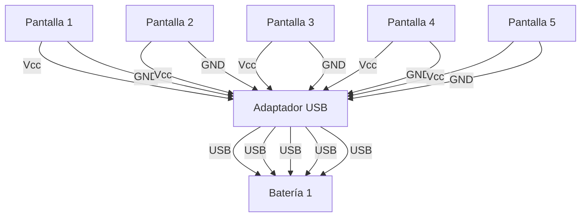

## Diagrama de Conexiones

Este diagrama de conexiónes está hecho en lenguaje Mermaid para MarkDown. 

```mermaid
graph TD;
    P1[Pantalla 1] --> |Vcc| USBA[Adaptador USB]
    USBA --> |USB| B1[Batería 1]
    P1 --> |GND| USBA;
    
    P2[Pantalla 2] --> |Vcc| USBA[Adaptador USB]
    USBA --> |USB| B1[Batería 1]
    P2 --> |GND| USBA;

    P3[Pantalla 3] --> |Vcc| USBA[Adaptador USB]
    USBA --> |USB| B1[Batería 1]
    P3 --> |GND| USBA;

    P4[Pantalla 4] --> |Vcc| USBA[Adaptador USB]
    USBA --> |USB| B1[Batería 1]
    P4 --> |GND| USBA;

    P5[Pantalla 5] --> |Vcc| USBA[Adaptador USB]
    USBA --> |USB| B1[Batería 1]
    P5 --> |GND| USBA;
```